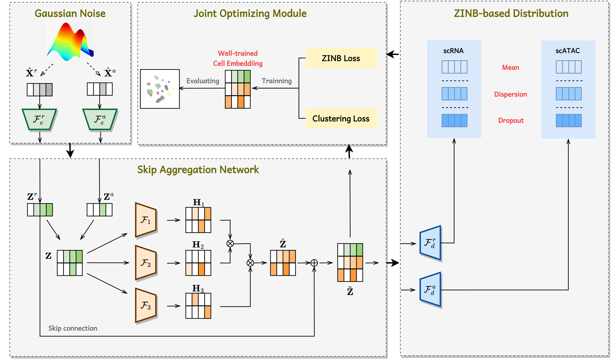

# scEMC: Effective Multi-Modal Clustering via Skip Aggregation Network

[](https://www.python.org/)
[](https://pytorch.org/)
[](https://academic.oup.com/bib)

## 📖 Overview

**scEMC** is an effective multi-modal clustering framework designed for the parallel analysis of **scRNA-seq** and **scATAC-seq** data.

This repository contains the official implementation of the paper: *Effective multi-modal clustering method via skip aggregation network for parallel scRNA-seq and scATAC-seq data*.

Integrating data from diverse modalities while preserving global structural information remains a significant challenge in single-cell analysis. To address this, **scEMC** introduces a novel **Skip Aggregation Network (SAN)**. This architecture allows the model to simultaneously:
1.  Learn global structural information among cells.
2.  Integrate heterogeneous data from diverse modalities effectively.

### Model Framework



## 🛠 Requirements

Please ensure your environment meets the following dependencies:

* **Python** == 3.7.0
* **Numpy** == 1.21.6
* **Torch** == 1.13.1
* **Scikit-learn** == 1.0.2
* **Scipy** == 1.7.3
* **Scanpy** == 1.9.3

### Installation
You can install the necessary packages using pip:

```bash
pip install numpy==1.21.6 torch==1.13.1 scikit-learn==1.0.2 scipy==1.7.3 scanpy==1.9.3
````

-----

## 📂 Data Availability

We provide an example dataset to facilitate the reproduction of our results.

| Dataset | Filename | Path | Format |
| :--- | :--- | :--- | :--- |
| **BMNC** | `BMNC.mat` | `scEMC/datasets/` | `.mat` (MATLAB) |

**Notes:**

  * The `.mat` format was selected for data storage due to its efficient compression capabilities.
  * **Customization:** If you need to modify the data loading logic (e.g., using new datasets), please edit the `load_data.py` file.

-----

## 🚀 Usage

### 1\. Configuration

Key parameters can be configured via command-line arguments. These are defined in the `parse_arguments` function within `scEMC.py`.

**Example Arguments:**

```python
parser = argparse.ArgumentParser(description='scEMC')
parser.add_argument('--n_clusters', default=data_para['K'], type=int, help='Number of clusters')
parser.add_argument('--lr', default=1, type=float, help='Learning rate')
# ... see code for full list ...
```

### 2\. Running the Model

To run scEMC with the default configuration (using the BMNC dataset):

```bash
python scEMC.py
```

-----

## 📧 Contact

If you have any questions about the code or the paper, please feel free to contact:

**Dayu Hu**
Email: [hudy@bmie.neu.edu.cn](mailto:hudy@bmie.neu.edu.cn)

-----

## 📝 Citation

If you find this work useful for your research, please consider citing our paper:

**Text:**

> Hu, D., Liang, K., Dong, Z., Wang, J., Zhao, Y., & He, K. (2024). Effective multi-modal clustering method via skip aggregation network for parallel scRNA-seq and scATAC-seq data. *Briefings in Bioinformatics*, 25(2), bbae102. Oxford University Press.

**BibTeX:**

```bibtex
@article{scEMC,
  title={Effective multi-modal clustering method via skip aggregation network for parallel scRNA-seq and scATAC-seq data},
  author={Hu, Dayu and Liang, Ke and Dong, Zhibin and Wang, Jun and Zhao, Yawei and He, Kunlun},
  journal={Briefings in Bioinformatics},
  volume={25},
  number={2},
  pages={bbae102},
  year={2024},
  publisher={Oxford University Press}
}
```

```
```
